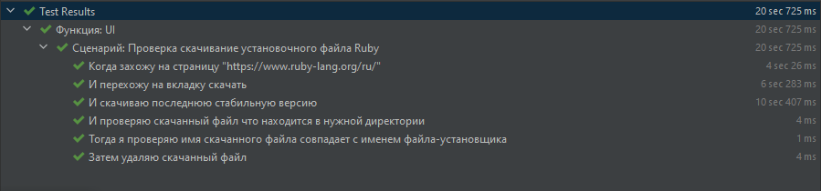
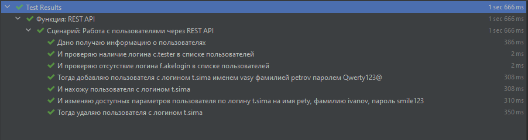

  
# Ефимов Алексей Геннадьевич
## Тестовое задание на должность "Тестировщик"

   
Задание

Необходимо выполнить следующие задания:
- Ознакомиться с тестами, которые находятся в папке feature
- Выполнить задания, которые описаны в каждом feature файле.

#### FAQ
1. Для работы тестов используется Ruby и его gem'ы
2. Для работы тестов требуется:
   1. Установить Ruby
   2. Установить требуемые gem'ы из файла со списком gem'ов
   3. Проверить совместимость файла драйвера браузера и версии браузера
3. Ссылку на Ваш репозиторий с проектом и отчет присылать на почту - marina.zayceva@ediweb.com с темой письма "Тестовое задание ФИО соискателя"
4. Если у Вас возникли затруднения в процессе выполнения задания, Вы можете задать вопрос, отправив письмо на почту marina.zayceva@ediweb.com с темой "Вопросы по тестовому заданию ФИО"

#### Рекомендации
1. Для более удобной настройки и запуска тестов рекомендуется использовать ОС семейства Linux (к примеру Ubuntu)
2. При использовании ОС семейства Windows можно воспользоваться образом VirtualBox http://tiny.cc/2ymuhz (пароль 123)

## Выполнено

1. Проект [Candidate test](https://github.com/Aleks4404/CandidateTest.git) написан на языке Ruby в интегрированной среде
   разработки ПО "[Intellij Idea RubiMine](https://www.jetbrains.com/ruby/)". 
2. Использован фремворк [Cucumber](https://cucumber.io/) для написание авто тестов. 
3. Использован фремворк [Selenium](https://www.selenium.dev/documentation/webdriver/browser_manipulation/#ruby) для написание авто тестов. 
4. Добавлен файл [Gemfile.lock](Gemfile.lock) со всеми библиотеками.  
5. Выполнено задание в файле [web_page_test.feature](features/web_page_test.feature).
   1. Написано сценарии выполнения. 
   2. Добавлены в файл [web_ui_steps.rb](features/step_definitions/web_ui_steps.rb) шаги выполения сценария. 
6. Выполнено задание в файле [rest_api_test.feature](features/rest_api_test.feature).
   1. Написано сценарии выполнения.
   2. Добавлены в файл [rest_tests_steps.rb](features/step_definitions/rest_tests_steps.rb) шаги выполения сценария.  

## Результат тестирования  
**Web page test**
> * Успешных тестов 100% (6 тестов)
> * Неуспешных тестов 0% (0 тестов)

   
ScreenShot

**Rest API test**
> * Успешных тестов 100% (7 тестов)
> * Неуспешных тестов 0% (0 тестов)

   
ScreenShot

